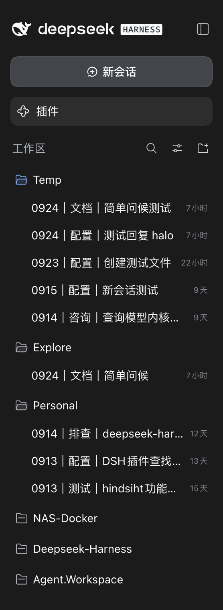
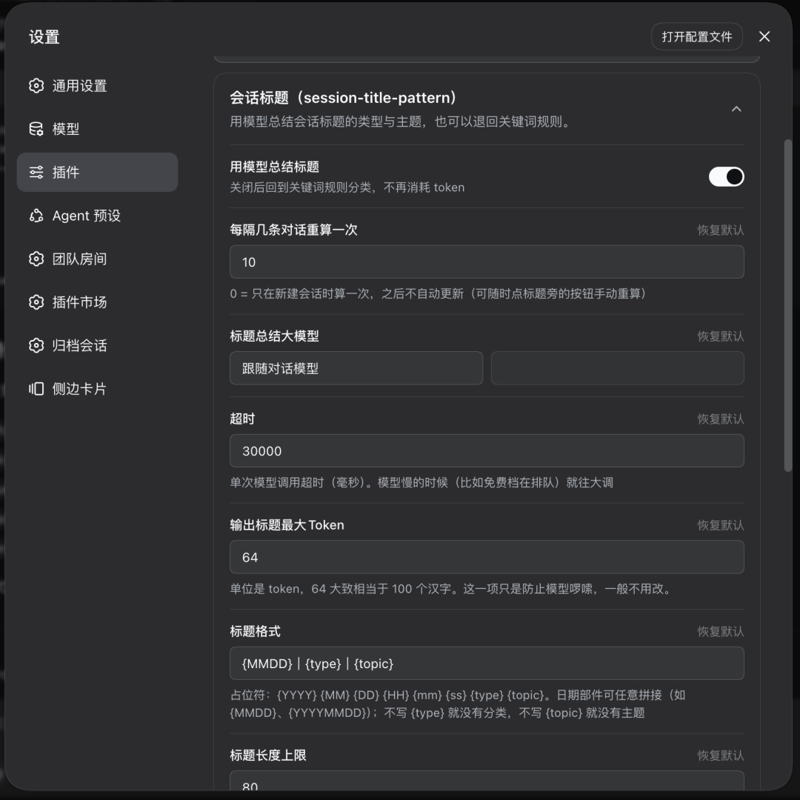
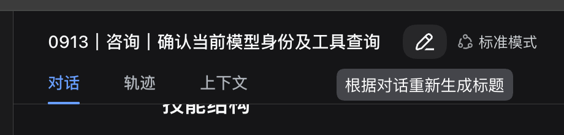

# 会话标题（session-title-pattern）

> 把 dsh 的会话标题变成 **`0913｜排查｜DeepSeek-Harness 登录失败`** —— 哪天、哪一类事、聊的什么，扫一眼就知道。
>
> 类型与主题由大模型对**整段对话**总结；不想花 token 就关掉模型，切回零 token 的关键词规则。



## 它解决什么问题

dsh 默认的标题是模型随手取的一句话（比如「确认当前模型身份及工具查询」）。它读起来像摘要，
但侧边栏一屏十几个会话时，**认不出哪个是哪天的、哪个属于哪一类事**。

这个插件把标题改成三段结构：

```
MMDD ｜ 类型 ｜ 主题
0913 ｜ 排查 ｜ DeepSeek-Harness 登录失败
```

- **日期** —— 本机**本地**日期，4 位 `MMDD`（取本地时区，东八区凌晨不会串成前一天）
- **类型** —— 两个汉字，概括这段会话在做什么（排查 / 生成 / 配置 / 查询…）
- **主题** —— 对**整段对话**的凝练、提炼关键词，而不是取首条消息的前几个字

三段之间用什么、要不要日期、要不要分类，全部可以自己配 —— 见「标题格式」。

## 功能一览

| 功能 | 说明 |
| --- | --- |
| **结构化标题** | `日期｜类型｜主题`，模板可自定义 |
| **模型总结** | 类型与主题由模型根据**整段对话**总结，不是取首条消息前几个字 |
| **成本恒定** | 每次重算只发「上次摘要 + 新增几轮」，输入大小与聊了多久**无关**；把间隔从 10 轮改成 20 轮也不改变总量级 |
| **按需更新** | 默认每 10 条对话滚动重算一次；也可以设成只在新建会话时算一次 |
| **随时手动重算** | 标题旁的「重命名会话」卡片（自动生成草稿→确认保存），或直接敲 `/retitle` |
| **锁定与手动改名** | 卡片内完成：预填当前标题、自动生成只填框不保存、确定保存即锁定；锁定开关可解除锁定（文字不变）恢复自动更新 |
| **零 token 开关** | 关掉「用模型总结标题」即回到关键词规则，不花 token、不联网 |
| **单独指定模型** | 标题用哪个模型可以单独选（建议配一个便宜的小模型，快且省） |
| **失败不伤标题** | 超时 / 报错 / 没有可用路由时，一律**保留上一个标题**，不会把已经好用的标题刷没 |
| **锁定与手动改名** | 标题旁的面板里一键锁定（停止自动更新）、直接改名（改名即自动锁定） |
| **重启不丢上下文** | 主线与摘要从会话日志恢复，dsh 重启后标题不会退回"只看最近几轮"的状态 |

## 标题格式

默认模板：

```
{MMDD}｜{type}｜{topic}      →      0913｜排查｜登录失败
```

可用占位符：`{YYYY}` `{MM}` `{DD}` `{HH}` `{mm}` `{ss}`（本地时区，可任意拼接成
`{YYYYMMDD}`、`{HHmmss}`）、`{type}`（分类）、`{topic}`（主题）。
**不写 `{type}` 标题里就没有分类，不写 `{topic}` 就没有主题。**

想换成「主题优先」或加上时分秒，直接改模板即可，例如 `{topic}｜{MMDD}`、`{YYYYMMDD} {topic}`。
详见 [配置](#配置)。

## 安装

```bash
dsh plugin --profile web add github:cq-guojia/dsh-session-title-pattern
```

安装后**无需任何额外配置**。

### 更新失败怎么办（**先查网络**）

更新失败时 dsh 会附一段说明，提到 `pnpm failed` 与 `allowBuilds`。
**但那段是它对「pnpm 失败」的通用提示，未必是本次病因** —— 实测踩到的一次完全是网络问题，
照着那个提示去改 `allowBuilds` 白折腾了一轮。所以按下面的顺序排查：

**第一步：能不能连上 GitHub。** 本插件是 `github:` 装的，pnpm 要从
`codeload.github.com` 下 tarball：

```bash
curl -sI -m 15 https://codeload.github.com/cq-guojia/dsh-session-title-pattern/tar.gz/HEAD | head -3
git ls-remote https://github.com/cq-guojia/dsh-session-title-pattern.git HEAD
```

拿不到 `HTTP/2 200`、或 `git ls-remote` 报 TLS 错（`gnutls_handshake() failed`）
→ **就是网络问题，等一会儿重试即可**，与插件无关。国内网络访问 GitHub 不稳是常态。

**第二步：网络正常却仍然失败**，才轮到 pnpm 的构建许可。先确认被拦的到底是谁：

```bash
cd ~/.dsh/profiles/<profile> && pnpm approve-builds    # 列出「待批准构建」的包
```

列出来的**不是**本插件（更常见的是构建工具链之类的传递依赖），那就不是这里的问题。
**列表为空**更是明确的信号：pnpm 并不认为有东西被拦，病因在别处。

确实是我们的话，再按 pnpm v11 的格式加白名单：

```yaml
allowBuilds:
  # 键必须用 git 地址 —— 只写包名对 git 托管包无效；@ 开头的键要加引号
  '@cq-guojia/dsh-session-title-pattern@git+https://github.com/cq-guojia/dsh-session-title-pattern.git': true
```

> `allowBuilds` 是 pnpm **v11** 的设置，形状是 map（不是 v10 那种数组式的
> `onlyBuiltDependencies`，后者 v11 已移除）。另外本插件的产物 `lib/` **已提交在仓库里**，
> 安装时并不需要编译 —— 它本来就不该出现在待批准列表里。

> 更新失败后 profile 可能停在「旧版本已卸掉、新版本没装上」的中间状态；
> 网络恢复后再 `add` 一次即可，重启前先确认 `dsh` 还能起来。

> **网络长期不稳的话**：`github:` 安装每次都要出海访问 `codeload.github.com`。若该 profile 的
> npm 源是国内镜像（如 `registry.npmmirror.com`），从 registry 安装会明显更稳。

### 关于版本锁定（重要）

git 安装有两种写法，行为差别很大：

| 写法 | 行为 |
| --- | --- |
| `github:cq-guojia/dsh-session-title-pattern` | 跟踪 `main` 分支，点「更新」会升级到最新 |
| `github:cq-guojia/dsh-session-title-pattern#v0.2.3` | **钉死在 v0.2.3**，点「更新」永远不会有变化 |

⚠️ 用 `#tag` 安装后，dsh-market / `dsh plugin update` 会按记录下来的 spec 重装，
结果版本纹丝不动（命令返回成功但版本未变）。要升级必须重新 `add` 并指定新 tag。

**每个发布版本都会打一个同名 tag**（`v0.6.2` 对应 `package.json` 的 `version`），
发版时 tag 与提交一起推。想知道最新是哪个版本：

```bash
git ls-remote --tags https://github.com/cq-guojia/dsh-session-title-pattern.git | tail -1
```

需要确定性时用 tag，需要能自动升级时不要带 tag。

### 与内置 LLM 标题插件的关系

`dsh-base` 默认启用 `session-title-llm`（用模型生成标题），而 `SessionTitleService`
**全局只允许注册一个 provider**，两者同时存在会直接报错。

本插件的 bundle patch 已自动禁用它：

```yaml
- id: session-title-llm
  disabled: true
```

所以你不需要手动改配置。**注意两者本质互斥，只能二选一。**

若想恢复 LLM 标题，在自己的 profile `cordis.patch.yml`（更靠后的层）写：

```yaml
- id: session-title-llm
  disabled: false
```

此时本插件会注册失败并降级为不提供标题——**不会拖垮 dsh 启动**，只会 warn 一条日志。

## 配置

两种方式，效果一样，可混用。

### 1. 设置界面（推荐）



打开 dsh 的「**设置 → 插件**」，找到本插件的卡片（默认**收起**，点标题行展开；有未保存的
改动时标题行会显示「未保存」）：

| 项 | 说明 |
| --- | --- |
| **用模型总结标题** | 开关。关掉即回到关键词规则，此时下面只保留标题格式相关的两项，其余全部隐藏 |
| **每隔几条对话重算一次** | 默认 `10`。仅模型模式。填 `0` = **只在新建会话时算一次**，之后不自动更新，随时可点标题旁的按钮手动重算 |
| **标题总结大模型** | 一行两个下拉：左边挑厂家（第一个选项是「跟随对话模型」），右边挑该厂家下的**具体模型，必须选一个、不给留空**；换厂家时右边自动落到新厂家的第一个模型。**只列出你已配置且可用的供应商**；跟随对话模型时右边置灰 |
| **超时** | 仅模型模式。模型慢的时候（比如免费档在排队）就往大调 |
| **标题格式** / **标题长度上限** | 两种模式都生效 |

改动是**暂存**的：改完点「保存」才写入。每个字段会标出是否**自定义**过，可以单字段「恢复默认」
（把该项清回默认值，同时也清掉它在用户层的覆盖）。底部还有「**放弃修改**」，
把这次没保存的改动全部丢掉、回到已保存的状态；没有改动可放弃时它是灰的。

> 卡片标题行那个「未保存」的判据是**值有没有变**，不是「有没有动过输入框」——
> 把 80 改成 90 再改回 80，标记会自动消失，保存按钮也跟着变灰。
> 鼠标停在标记上会列出**到底哪几项**和已保存的值不同。

> 「自定义」的判定是「与你写的值**不等于**默认值」：填了一个恰好等于默认值的数，
> 保存时不会往用户层记一笔，等于没改。

> provider 与 model 必须**成对**填写。只填一个时保存会被拒绝并提示（这是 schema 表达不了的
> 跨字段约束，由 host 侧校验）。

### 2. profile 的 `cordis.patch.yml`

适合脚本化或批量部署：

```yaml
- id: session-title-pattern
  config:
    mode: llm
    retitleEvery: 10
    template: '{MMDD}｜{type}｜{topic}'
    maxBytes: 80
```

| 键 | 类型 | 默认值 | 说明 |
| --- | --- | --- | --- |
| `mode` | `llm` \| `rules` | `llm` | `llm` 由模型总结类型与主题；`rules` 走零 token 的关键词规则 |
| `retitleEvery` | number | `10` | 每多少条人类消息重算一次标题（仅 LLM 模式），最小 `0`。**`0` = 只在新建会话时算一次，之后不自动更新** |
| `provider` | string | 空 | 指定模型 provider，**必须与 `model` 成对**；留空则跟随会话主模型 |
| `model` | string | 空 | 指定模型 id，**必须与 `provider` 成对** |
| `timeoutMs` | number | `30000` | 单次模型调用超时（毫秒）。手动重算会基于整段对话重来，叠加免费档排队时 15 秒实测不够，故默认 30 秒 |
| `maxOutputTokens` | number | `512` | 输出 token 上限的**保险丝**（服务端硬切断，到点就停）。**界面上不出现**，需要时走 `cordis.patch.yml` —— 它不是「软限制」，调大也不额外花钱（模型真写了才计费） |
| `maxInputBytes` | number | `4096` | 单次调用输入字节上限（滚动摘要的硬预算） |
| `template` | string | `{MMDD}｜{type}｜{topic}` | 标题格式模板，写法见下 |
| `maxBytes` | number | `80` | 标题总长度上限（UTF-8 字节），最小 20 |

> **`template` 怎么写**：`{...}` 里可以写
> `YYYY` `MM` `DD` `HH` `mm` `ss`（日期时间部件，**本地时区**，可任意拼接，
> 如 `{MMDD}` / `{YYYYMMDD}` / `{HHmmss}`；注意 `MM` 是月、`mm` 是分）、
> `type`（分类）、`topic`（主题）。
> **不写 `{type}` 标题里就没有分类，不写 `{topic}` 就没有主题。**
> 例如 `{YYYYMMDD} {topic}` → `20260913 登录失败`。
> 认不出的占位符会**原样留在标题里**（如 `{date}`），方便一眼看出是模板写错了。
>
> 默认模板里的 `｜` 是全角竖线（U+FF5C），占 3 个 UTF-8 字节。

> ⚠️ **`maxBytes` 必须 ≤ `session-title` 行的 `maxTitleBytes`**（`dsh-base` 默认为 **80**）。
> 服务在写入前会按该值二次截断，超出部分被**静默丢弃**，不会有任何报错。
> 如果你调整了 `session-title.maxTitleBytes`，这里要同步调整。

> **两层优先级**：解析顺序是 `schema 默认值 → 组合层（本节） → 用户层（设置界面）`。
> 也就是说界面里改过的字段，改 `cordis.patch.yml` 不会生效，除非先在界面上「恢复默认」。
>
> **兼容性**：设置卡片依赖 dsh 自带的设置界面（`@deepseek-ai/dsh-client-ui-settings*`），
> 本插件的 `dsh.client.inject` 声明了它们。如果你的 dsh 版本没有这些包，客户端部分会一直
> pending 并**导致启动失败** —— 这种情况请用 v0.3.2。

## LLM 模式

默认开启。类型与主题由模型总结，**一次调用同时产出两者**。

### 什么时候调用模型

- **第 1 条消息** —— 由 dsh 自身的自动调度生成
- **之后每 `retitleEvery` 条**（默认 10）—— 由本插件按轮次显式触发一次重算；
  `retitleEvery` 为 `0` 时**跳过这一步**，标题只在新建会话时生成一次，之后不再自动更新
- 其余轮次**完全不调用模型**，标题保持不变

> 只处理**顶层会话**。fork 出的子会话（子代理）不做自动命名、也不参与重算，
> 否则每次 fork 都要多付一次模型调用。

### 成本为什么恒定

关键在于**滚动摘要 + 主线锚**。每次重算发的是：

```
① 首条消息（截断到 200 字节）   ← 锚住会话最初的目标
② 上次的主线（一行）            ← 模型逐轮维护的「这段会话主要在干什么」
③ 上次摘要（一行）              ← 上一次输出的 类型|主题
④ 等距采样的 2 条历史消息        ← 让模型看到会话怎么演化
⑤ 上次之后的新增人类消息         ← 正常情况下就是「每 N 轮」那么多条
```

② 的「主线」由模型逐轮判断并延续：**会话目标没变就原样返回**；修 bug、处理报错都算主线的
**子任务**，不会把主线带偏。④ 的采样让长会话（尤其是重启恢复之后）不至于只剩最近的记忆。

③ 里的「摘要」不是额外生成的东西 —— **它就是模型上一次输出的那一行**（既是标题，也是下一次的输入）。
所以早期对话的原文只会向前压缩，**永远不会被重新发送**。

输入大小与会话聊了多久无关：每次重算合计大约几百 token。
间隔调大只影响「多久更新一次」，不改变总量级 —— 默认 10 轮时聊到 100 轮，总计也就几万 token。

### 失败时怎么办

超时、模型报错、没有可用模型路由……**一律保留上一次的标题，不覆盖**，日志里记一条 `warn`。

首轮就失败时没有可保留的标题，此时 dsh 的内置 fallback 会顶上（首条消息的前 5 个词 / 40 字节）。

### 用哪个模型

默认**跟随会话当前的主模型**（取自会话记录的主请求路由），零配置即可使用。
想用便宜的小模型跑标题，就把 `provider` 与 `model` 一起填上：

```yaml
- id: session-title-pattern
  config:
    mode: llm
    provider: <provider-id>
    model: <model-id>
```

⚠️ 两项**必须成对**。只填一个会被忽略并 warn，然后回落到跟随主模型。

### 想省钱或关掉

```yaml
- id: session-title-pattern
  config:
    mode: rules
```

`rules` 模式完全不调用模型，回到关键词分类 + 首条消息主题，见[分类规则](#分类规则)。

## 手动生成标题



两种方式，底层是同一组命令：

**1. 头部按钮 → 重命名卡片** —— **标题右侧第一个**位置有个铅笔图标，点开是一张
「重命名会话」卡片（对标官方重命名对话框的布局）：

- 输入框**预填当前标题**，可直接改
- **自动生成** —— 按当前模式（LLM/规则）真算一版标题，**只填进输入框、不保存**；
  满意就点「确定保存」，不满意可以再点一次或手动改
- **确定保存** —— 写入新标题（写入即锁定，见下）
- **锁定开关**（左下角）—— 锁定后标题不随对话轮数自动更新；**解除锁定只改状态**，
  标题文字不变、不触发重新生成，之后恢复自动更新

锁定与「确定保存」用的是平台内置的标题固定机制（来源 = 用户），全链路生效：
侧边栏、自动调度、我们的重算计时器都认它。面板走 `/title-suggest`、`/title-rename`、
`/title-lock`、`/title-unlock` 四条命令，也可以在输入框里直接敲。

> 位置说明：用的是 `conversation.session.header.actions`。上游头部结构是
> `titleCluster > (crumbs, headerActions)`，这一组紧贴标题；注册时给一个很小的负数 `order`，
> 保证排在所有占用者之前，即标题右边第一个 —— 内置的「标准模式」指示器在它右侧，
> 其他插件后挂的条目也都在右边。
>
> 另外，dsh 的 slots 系统只在「会话头部 / 输入区 / 侧边栏框架」这些扩展位开放挂载。
> 会话列表每一行的三点菜单（重命名 / 分叉 / 归档）和重命名对话框都是封闭组件、没有 slot，
> 第三方插件无法往里加菜单项。

**2. 直接敲命令** —— 在输入框输入 `/retitle` 回车。

自动命名只在「非 fork 子会话 且 是第一条人类消息 且 尚无标题」时触发，所以手动入口是后续改标题的唯一方式。

> 手动重命名过的会话会进入「已固定」状态，自动命名随之停止调度。
> `/retitle` 是解除固定、让规则重新接管的唯一途径。

## 标题显示宽度

dsh 头部把会话标题渲染成**面包屑的最后一段**，上游样式给它写死了 `max-width:220px`：

```css
.wSkVaW_crumb { max-width:220px; padding:4px 8px; overflow:hidden;
                text-overflow:ellipsis; white-space:nowrap; font-size:14px; line-height:20px }
```

`220 − 16(左右内边距) = 204px` 可用，而 `MMDD｜类型` 前缀就吃掉约 94px —— 留给主题的约 110px，
14px 字号下就是**七八个中文字**。这跟窗口大小无关，屏幕再大也一样。

本插件在客户端激活时**自动注入**一条覆盖规则，无需你配置任何东西：

```css
[class*="_crumbCurrent"]{max-width:min(640px, 60vw) !important;}
```

- 只放宽**当前会话标题**这一个面包屑；祖先会话与子代理的面包屑保持 220px
- `640px` 是按标题上限 80 字节（约 40 个中文，约 560px）留的余量
- `60vw` 兜住窄窗口；宽度真不够时靠 `.crumb` 自带的 `overflow:hidden` 自动收缩省略，不会溢出

> 为什么不能用插件槽位做：标题元素由上游无条件原生渲染，`conversation.session.header.lineage`
> 这个槽位只能在其**后面**追加节点，无法替换它。详见 [DEVELOPMENT.md](./DEVELOPMENT.md)。

### 没生效时怎么排查

这条规则靠 CSS Modules 生成的类名后缀 `_crumbCurrent` 命中。上游若重命名该类名，规则会
**静默失效** —— 不报错、不崩溃，只是标题又变短。

DevTools 选中标题元素，检查：

1. `class` 属性里是否还有 `_crumbCurrent`
2. Computed 面板的 `max-width` 是否为 `640px`（宽屏）或 `60vw` 对应值

如果类名变了，把新的完整 class 字符串反馈即可。

## 分类规则

**只在 `rules` 模式下决定类型**。在默认的 `llm` 模式下，模型给出的类型优先；
只有模型没按 `类型|主题` 格式输出时，才回退到这里。

按**顺序**匹配，先命中先赢；全部未命中则为 `其他`。

| 顺序 | 类型 | 关键词 |
| --- | --- | --- |
| 1 | `指令` | `/` 开头、command、指令、命令 |
| 2 | `鉴权` | 登录、鉴权、auth、login、oauth |
| 3 | `接口` | 接口、api、endpoint、路由 |
| 4 | `查询` | 查询、search、fetch、获取、read、什么、如何、为什么、怎么、哪 |
| 5 | `创建` | 创建、新增、insert、add、write、生成、写、做、建、弄 |
| 6 | `更新` | 更新、修改、update、edit、patch、改、调整、变、换 |
| 7 | `删除` | 删除、delete、remove、drop、删、移除、去、清 |
| 8 | `测试` | 测试、test、单测、集成、验证、检查、跑 |
| 9 | `配置` | 配置、config、setup、设置、装、部署 |
| 10 | `修复` | 错误、bug、异常、fix、报错、问题、错、故障 |
| 11 | `文档` | 文档、doc、readme、说明、帮助、教程 |
| — | `其他` | 兜底 |

### 客户端按钮导致启动失败时的自救

从 v0.2.1 起本插件带浏览器端代码（package.json 中的 `dsh.client`）。若产物与你的 dsh
版本不兼容，dsh 会启动失败。两种恢复方式：

1. **只关掉本插件** —— 在 profile 的 `cordis.patch.yml` 里写：

   ```yaml
   - id: session-title-pattern
     disabled: true
   ```

2. **回退到纯命令版** —— v0.2.0 只有 host 端命令，没有浏览器代码：

   ```bash
   dsh plugin --profile web add git+https://github.com/cq-guojia/dsh-session-title-pattern.git#v0.2.0
   ```

## 已知限制

- **fork 出的子会话不会自动命名**。`first-prompt` 的触发条件要求「非 fork 会话 且 是第一条人类消息 且 尚无标题」。
- **模型总结会有损**：早期对话会被压缩进一行摘要，细节可能丢失（这是成本恒定的代价）。
- `rules` 模式下**只看首条人类消息**，后续对话不参与，也不会重算标题。
- **分类是顺序敏感的规则匹配**，「查一下接口文档并修复」会命中 `查询` 而非 `修复`；单字关键词（`改`/`去`/`清`/`做`）存在误判。
- **标题会被写入两次**：服务先写入内置 fallback（前 5 个词），再被本插件的结果覆盖。这是上游设计，UI 上可能看到一次标题跳变。
- **仅有中文分类词表**，英文消息也能匹配英文关键词，但类型标签仍是中文。

## 开发

```bash
npm install
npm run build        # 先构建 host 再构建 client
npm run typecheck
```

> **`lib/` 是提交进 git 的构建产物** —— dsh 加载的是 `package.json` 的 `main`（`lib/index.mjs`），
> 运行时不编译 TypeScript。改完 `src/` 必须重新 `npm run build` 并把 `lib/` 一起提交，否则改动不会生效。

## 相关文档

- [DEVELOPMENT.md](./DEVELOPMENT.md) —— 开发进度追踪

## 许可证

MIT
