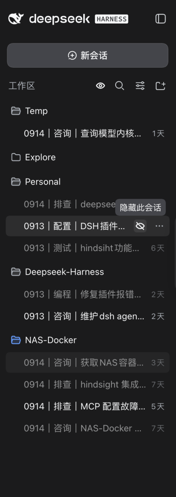
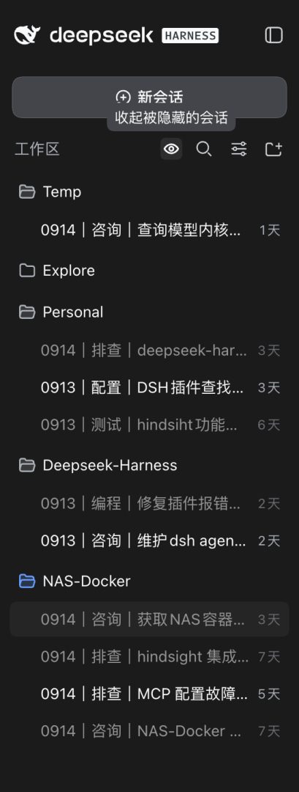
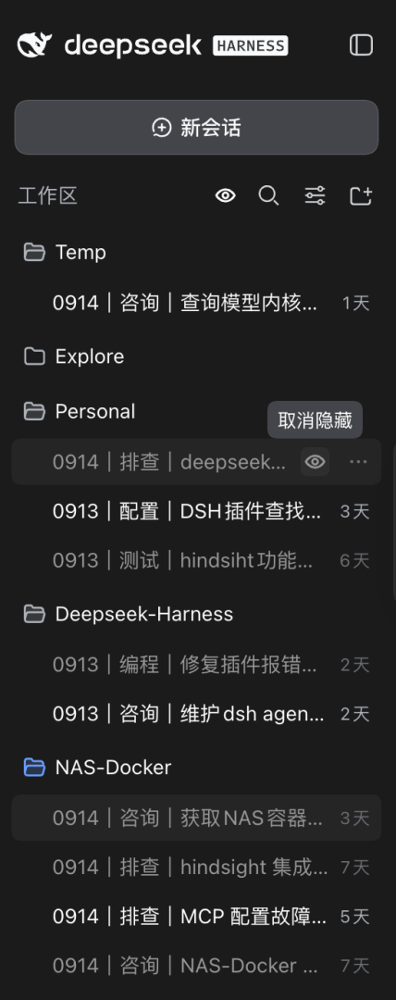

# 会话标题 + 隐藏会话（session-title-pattern）

[English](README.md) | 中文

给 dsh 侧边栏加两个小工具：**标题一眼看懂**，**暂时不用的会话随手藏起来**。


- **自动命名标题** —— 把标题统一成 `0913｜排查｜登录失败`：哪天、哪一类事、聊的什么，
  由大模型对**整段对话**总结（中文两个汉字、英文一个单词）
- **隐藏会话** —— 把暂时不用的会话藏起来，侧边栏只留最近要用的几个；随时一键显示回来，
  不删任何东西

## 安装

```bash
dsh plugin --profile web add dsh-session-title-pattern
```

每个稳定正式版都发布到 npm，装完就能用，不需要额外配置，也不需要本地编译。

## 功能一：自动命名标题

### 标题长什么样

dsh 默认的标题是模型随手取的一句话（比如「确认当前模型身份及工具查询」），侧边栏一屏十几个
会话时认不出哪个是哪天、属于哪一类事。本插件把标题改成三段：

```
MMDD ｜ 类型 ｜ 主题
0913 ｜ 排查 ｜ DeepSeek-Harness 登录失败
```

- **日期** —— 本机**本地**日期，4 位 `MMDD`（东八区凌晨不会串成前一天）
- **类型** —— 概括这段会话在做什么，**跟界面语言走**：界面是中文就两个汉字（排查 / 生成 / 配置…），
  界面是英文就一个单词（Debug / Config / Docs）—— 英文对话配中文界面，类型仍然是中文
- **主题** —— 对**整段对话**的凝练，而不是取首条消息的前几个字

格式可以自己改，默认模板是 `{MMDD}｜{type}｜{topic}`：

| 占位符 | 含义 |
| --- | --- |
| `{YYYY}` `{MM}` `{DD}` `{HH}` `{mm}` `{ss}` | 日期时间部件，**本地时区**，可任意拼接（`{YYYYMMDD}`、`{HHmmss}`） |
| `{type}` | 类型。**不写就没有类型**；渲染不出内容时**整段消失**，相邻分隔符一并收掉 |
| `{topic}` | 主题。**不写就没有主题**；同样会在为空时整段消失 |

直接改模板即可，例如 `{topic}｜{MMDD}`（主题在前）、`{YYYYMMDD} {topic}`（带年份）。

### 什么时候自动更新

- **第 1 条消息** —— 由 dsh 自身调度，先生成一版标题
- **之后每 10 条对话**（可配）—— 本插件触发一次重算，其余轮次完全不调用模型
- 只处理顶层会话，fork 出的子会话不参与自动命名

每次重算只发「首条消息 + 上次主线 + 上次摘要 + 新增几轮」，合计几百 token，
**跟会话聊了多久无关**（早期对话的原文只会向前压缩，不会被重新发送）。

模型默认跟随会话当前的主模型；也可以在设置里单独指定。

失败时的表现分两种：

- **已经有标题**：超时、报错、没有可用路由一律**保留上一个标题**，不会把已经好用的标题刷没
- **还没有标题**（新建会话的第一次就失败）：不再等模型，直接本地拼一版兜底标题 ——
  日期照常、**类型省略**、主题取首条消息的**前几个词**（与 dsh 自带那次首次命名同一套口径：
  前 8 个空格分隔的词 + 字节上限；中文没有空格，所以中文实际是整句按字节截），
  例如 `0915｜登录失败的原因`。下一轮重算只要模型通了就会把它换掉

**类型**用的语言与界面文案一致 —— 都跟随 dsh 的**界面语言**（设置 → 通用里的语言）；
**主题**跟随**对话语言**。所以英文对话 + 中文界面得到的正是 `0915｜排查｜Login 401`。

### 手动重算与改名


**点头部按钮**：标题右侧第一个位置有个铅笔图标，点开是一张「重命名会话」卡片 ——
输入框预填当前标题，可以手动改；「自动生成」会真算一版标题、**只填进输入框**；
「确定保存」写入并锁定（锁定后不再自动更新），左下角的锁定开关可随时解除。

**敲命令**：在输入框输入 `/retitle` 回车。

> 自动命名只在「非 fork 子会话 且 第一条人类消息 且 尚无标题」时触发，所以后续改标题只能走
> 上面两个入口。会话列表每行的三点菜单（重命名 / 分叉 / 归档）是平台封闭组件、没有扩展位，
> 第三方插件无法往里加菜单项。

### 标题显示宽度

dsh 把标题渲染成面包屑的最后一段，上游给它写死了 `max-width:220px` —— 扣掉内边距、再减去
`MMDD｜类型` 前缀，留给主题的只有七八个中文字。本插件在客户端激活时**自动注入**一条覆盖规则
（无需任何配置）：

```css
[class*="_crumbCurrent"]{max-width:min(640px, 60vw) !important;}
```

只放宽**当前会话标题**，祖先会话与子代理的面包屑保持原样。若上游改了类名，这条规则会静默失效
（不报错，只是标题又变短）—— DevTools 选中标题元素，看 `class` 里是否还有 `_crumbCurrent`
即可确认。

## 功能二：隐藏会话

dsh 只有「归档」一种收起会话的方式，而且是单向的：收起来之后想找回来很麻烦
（平台侧写明没有取消归档的入口：*No Session deletion or unarchive control*）。

但很多会话只是暂时不用了 —— 不想删掉，一直留在侧边栏又碍事。本插件提供一份**自己维护的
隐藏列表**：把暂时不用的藏起来，侧边栏只留最近要用的几个，需要时一键显示回来，随时可逆。

| | 隐藏（本插件） | 归档（平台） |
| --- | --- | --- |
| 范围 | 只影响侧边栏显不显示 | 所有分组界面都不再列出 |
| 可逆 | 随时显示回来 | 想找回来很麻烦 |
| 会话本身 | 完全不动 | 完全不动 |

### 怎么用

**隐藏一条**：鼠标移到会话行，点行尾那只**划线眼**。



**看回来**：点「工作区」标题行上放大镜左边那只**眼睛**（总开关），被藏起来的会话就都回来了，
只是**颜色更淡**；点某个会话行上的眼睛即可单独取消隐藏。





两个图标的语义统一为「**眼睛 = 这些东西现在已经露出来了**」：会话行已隐藏 → 眼睛（点它取消
隐藏），未隐藏 → 划线眼；总开关正在显示被隐藏的会话 → 眼睛，否则划线眼。鼠标停在眼睛上会
**立刻**弹出说明。

正在打开的那一条会先留着（避免正在聊的内容突然"消失"），切到别的会话后它自然消失。

**想关掉整个功能**：设置卡片里的「**启用隐藏会话**」（默认打开）一点即生效。关掉 ≠ 重置 ——
设过的隐藏列表原样保留，以后再打开该隐藏的还是隐藏着；要真正清空，用卡片里的「全部取消隐藏」。

### 它是什么、不是什么

- 隐藏只影响侧边栏显示：会话仍在列表里，打开、搜索、命令、标题自动生成全部照常。
- **不会**删除会话，也不动会话日志；隐藏列表存在本插件的设置文档里，刷新、重启、换浏览器都保持。
- 隐藏是在 DOM 层实现的（平台没有能按会话过滤列表行的扩展位），上游一改版可能静默失效 ——
  点不动、藏不掉的时候，先看控制台有没有 `[dsh-session-title-pattern]` 前缀的告警；
  设置卡片里的「全部取消隐藏」是随时可用的兜底出口。

## 配置

### 设置界面（推荐）


打开 dsh 的「**设置 → 插件**」，找到本插件的卡片（默认**收起**，点标题行展开）：

| 项 | 说明 |
| --- | --- |
| **每隔几条对话重算一次** | 默认 `10`。填 `0` = 只在新建会话时算一次 |
| **标题总结大模型** | 一行两个下拉：左边挑厂家（第一个是「跟随对话模型」），右边挑该厂家的**具体模型**。只列出你已配置且可用的供应商 |
| **超时** | 模型慢的时候（比如免费档排队）就往大调 |
| **标题格式** / **标题长度上限** | 标题的三段长什么样、最长多少 |
| **启用隐藏会话** | 隐藏会话功能的总开关，一点即生效 |

改动是**暂存**的，点「保存」才写入；每个字段会标出是否**自定义**过，可以单字段「恢复默认」，
底部「**放弃修改**」丢掉这次没保存的改动。

> 界面文案**中英双语**，跟随 dsh 的界面语言（设置 → 通用里的语言）。

### profile 的 `cordis.patch.yml`

适合脚本化或批量部署：

```yaml
- id: session-title-pattern
  config:
    retitleEvery: 10
    template: '{MMDD}｜{type}｜{topic}'
    maxBytes: 80
```

| 键 | 类型 | 默认值 | 说明 |
| --- | --- | --- | --- |
| `retitleEvery` | number | `10` | 每多少条人类消息重算一次标题，最小 `0`；`0` = 只在新建会话时算一次 |
| `provider` | string | 空 | 指定模型 provider，**必须与 `model` 成对**；留空则跟随会话主模型 |
| `model` | string | 空 | 指定模型 id，**必须与 `provider` 成对** |
| `timeoutMs` | number | `30000` | 单次模型调用超时（毫秒） |
| `maxOutputTokens` | number | `512` | 输出 token 上限的保险丝。界面上不出现，需要时走这里 |
| `maxInputBytes` | number | `4096` | 单次调用输入字节上限 |
| `template` | string | `{MMDD}｜{type}｜{topic}` | 标题格式模板 |
| `maxBytes` | number | `80` | 标题总长度上限（UTF-8 字节），最小 20 |
| `hiddenEnabled` | boolean | `true` | 隐藏会话功能的总开关 |
| `hiddenSessions` | string[] | `[]` | 被隐藏的会话 id（由界面上的眼睛按钮写，不用手填） |
| `revealHiddenAll` | boolean | `false` | 是否把被隐藏的会话显示出来 |

> 默认模板里的 `｜` 是全角竖线（U+FF5C）。认不出的占位符会**原样留在标题里**（如 `{date}`），
> 方便一眼看出是模板写错了。
>
> ⚠️ `maxBytes` 必须 ≤ `session-title` 行的 `maxTitleBytes`（`dsh-base` 默认 **80**），
> 超出部分会被**静默截断**。
>
> 优先级是 `schema 默认值 → 组合层（本节） → 用户层（设置界面）`：界面里改过的字段，
> 改 `cordis.patch.yml` 不会生效，除非先在界面上「恢复默认」。

## 出问题时

**dsh 启动失败**：本插件带浏览器端代码，dsh 版本过老可能不兼容。在 profile 的
`cordis.patch.yml` 里**只关掉本插件**即可恢复，之后升级 dsh 再重新安装：

```yaml
- id: session-title-pattern
  disabled: true
```

## 开发

```bash
npm install
npm run build        # 先构建 host 再构建 client
npm run typecheck
```

> **`lib/` 是提交进 git 的构建产物** —— dsh 加载的是 `package.json` 的 `main`（`lib/index.mjs`），
> 运行时不编译 TypeScript。改完 `src/` 必须重新 `npm run build` 并把 `lib/` 一起提交，
> 否则改动不会生效。

实现细节（成本模型、隐藏会话为什么只能在 DOM 层做、历代踩坑）记在
[DEVELOPMENT.md](./DEVELOPMENT.md)（仅中文）。

> 本 README 有中英两份：本文件与 [README.md](README.md)。**改一份必须同时改另一份** ——
> 有读者看的那份才是有效的那份。

## 许可证

MIT
